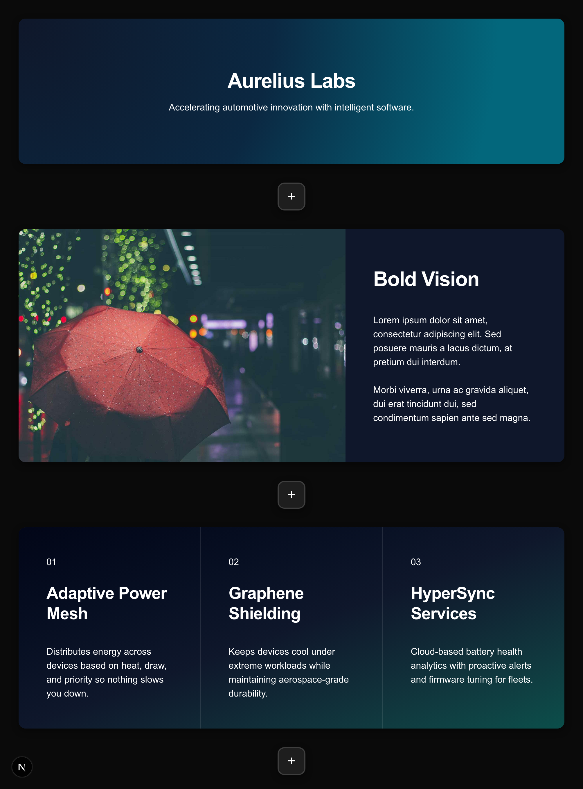

# BlockSlides

BlockSlides is a ProseMirror-powered slide authoring toolkit that provides the core building blocks, schema, and UI bindings needed to build interactive presentation editors. The project adapts the TipTap-inspired architecture to support slide-specific concepts such as rows, columns, and layout-driven styling.



## Features

- Slide-first schema: built-in slide, row, and column nodes with layout-aware behaviors tailored to deck authoring.
- Core editor runtime exposed via `@blockslides/core`
- React bindings (`@blockslides/react`) and a prebuilt extension kit for rapid prototyping

## Prerequisites

- Node.js 18.17+

## Quickstart for React

**Step 1 - Install Dependencies**

```
pnpm add @blockslides/react @blockslides/core @blockslides/pm @blockslides/extension-kit
```

**Step 2 - Create useSlideEditor hook**

```
"use client";

import { useEditor } from "@blockslides/react";
import { ExtensionKit } from "@blockslides/extension-kit";
import type { AnyExtension, Editor } from "@blockslides/core";

declare global {
  interface Window {
    editor: Editor | null;
  }
}

type UseSlideEditorProps = {
  onUpdate?: (content: string) => void;
  content?: string | object;
  extensions?: AnyExtension[];
};

export type { UseSlideEditorProps };

export const useSlideEditor = ({
  content,
  onUpdate,
}: UseSlideEditorProps = {}) => {
  const handleUpdate = onUpdate ?? (() => {});

  const editor = useEditor(
    {
      immediatelyRender: false,
      shouldRerenderOnTransaction: false,
      content,
      theme: "dark",
      onUpdate: (ctx: { editor: Editor }) => {
        //add optional debounce to update
        handleUpdate(JSON.stringify(ctx.editor.getJSON()));
      },
      extensions: [ExtensionKit.configure({})],
      editorProps: {
        attributes: {
          autocomplete: "off",
          autocorrect: "off",
          autocapitalize: "off",
          class: "min-h-full min-w-full",
        },
      },
    },
    []
  );

  // Expose editor instance globally for debugging
  if (typeof window !== "undefined") {
    window.editor = editor;
  }

  return { editor };
};

```

**Step 3 - Create SlideEditor Component**

```
import { EditorContent } from '@blockslides/react'
import { useSlideEditor } from '@/components/SlideEditor/hooks/useSlideEditor'

export const SlideEditor = ({
  content,
  onUpdate,
}: {
  onUpdate?: (content: string) => void
  content?: string | undefined | object
}) => {
  const { editor } = useSlideEditor({ onUpdate, content })

  if (!editor) {
    return null
  }


  return (
    <div className='p-8'>
      <EditorContent editor={editor} />
    </div>
  )
}
```

**Step 4 - Import SlideEditor component and feed in content** -
See Sample content at bottom

```
'use client'

import dynamic from 'next/dynamic'
import { useMemo } from 'react'

import { content } from '@/examples/content'

const Home = () => {

    const SlideEditor = useMemo(
        () =>
            dynamic(
                () =>
                    import('@/components/SlideEditor').then(
                        (mod) => mod.SlideEditor
                    ),
                {
                    ssr: false,
                }
            ),
        []
    )

    return (
        <div >
            <SlideEditor content={content} />
        </div>
    )
}

export default Home

```

## Schema Overview

BlockSlides extends the base ProseMirror schema with slide-focused nodes:

- **Document → `slide+`**: every document starts as a stack of slides.
- **`slide` node**: wraps one or more `row` nodes, carrying slide-level attributes (classes, theming).
- **`row` node** (`@blockslides/extension-row`): horizontal flex container; can host `column` nodes or fallback `block` content. Supports layout presets via `data-layout` (e.g., `1-1`, `1-2-1`).
- **`column` node** (`@blockslides/extension-column`): vertical flex container inside a row; controls alignment, padding, and stacking of nested blocks or rows for complex grids.
- **Block content**: paragraphs, headings, bullet/ordered lists, images, videos, and any custom nodes added via extensions.
- **Marks**: bold, italic, underline, highlight, links, code, font-family, font-size, text color/shadow, superscript/subscript, etc., defined under `packages/core/src/schema/marks`.

All nodes and marks follow standard ProseMirror specs, so you can extend or override them as needed. The `@blockslides/extension-kit` package exports a curated set of extensions (slides, rows, columns, text blocks, list support, layout UI helpers) to jump-start editor configuration. **All extensions are set to true by default**

## Schema Examples

```

const singleSlideDoc = {
  type: 'doc',
  content: [
    {
      type: 'slide',
      attrs: { id: 'slide-1' },
      content: [
        {
          type: 'row',
          attrs: { layout: '1' },
          content: [
            {
              type: 'column',
              content: [
                {
                  type: 'heading',
                  attrs: { level: 2 },
                  content: [{ type: 'text', text: '...' }],
                },
                {
                  type: 'paragraph',
                  content: [{ type: 'text', text: '...' }],
                },
              ],
            },
          ],
        },
      ],
    },
  ],
};


const threeColumnSlide = {
  type: 'slide',
  attrs: { id: 'feature-grid' },
  content: [
    {
      type: 'row',
      attrs: {
        layout: '1-1-1',
        className:
          '...'
      },
      content: [
        {
          type: 'column',
          attrs: {
            className:
              '...'
          },
          content: [
            {
              type: 'imageBlock',
              attrs: {
                src: '...',
                layout: 'cover',
                alt: 'Telemetry dashboard preview',
              },
            },
            {
              type: 'paragraph',
              content: [
                {
                  type: 'text',
                  text:
                    '...',
                },
              ],
            },
          ],
        },
        { type: 'column', ...},
        { type: 'column', ...},
      ],
    },
  ],
};

```

## Sample Content

```
export const content = {
    type: 'doc',
    content: [
        {
            type: 'slide',
            attrs: { id: 'title-gradient-center' },
            content: [
                {
                    type: 'row',
                    attrs: { layout: '1' },
                    content: [
                        {
                            type: 'column',
                            attrs: {
                                className:
                                    'min-h-full flex text-white items-center justify-center bg-[radial-gradient(circle_at_top_left,_#0f172a,_#0b2842_45%,_#03677c_85%)]',
                            },
                            content: [
                                {
                                    type: 'heading',
                                    attrs: { level: 2, },
                                    content: [{ type: 'text', text: 'Aurelius Labs' }],
                                },
                                {
                                    type: 'paragraph',
                                    content: [
                                        { type: 'text', text: 'Accelerating automotive innovation with intelligent software.' },                                    ],
                                },
                            ],
                        },
                    ],
                },
            ],
        },
        {
            type: 'slide',
            attrs: { id: 'hero-with-title' },
            content: [
                {
                    type: 'row',
                    attrs: { layout: '2-1' },
                    content: [
                        {
                            type: 'column',
                            content: [
                                {
                                    type: 'imageBlock',
                                    attrs: {
                                        src: 'https://picsum.photos/seed/hero-cover/2000/1200',
                                        layout: 'cover',
                                        fullBleed: true,
                                        alt: 'Dramatic mountain landscape with mist',
                                    },
                                },
                            ],
                        },
                        {
                            type: 'column',
                            attrs: {
                                className: 'bg-slate-900 text-white flex flex-col justify-center gap-6 px-12 py-16',
                            },
                            content: [
                                {
                                    type: 'heading',
                                    attrs: { level: 2 },
                                    content: [{ type: 'text', text: 'Bold Vision' }],
                                },
                                {
                                    type: 'paragraph',
                                    content: [
                                        {
                                            type: 'text',
                                            text: 'Lorem ipsum dolor sit amet, consectetur adipiscing elit. Sed posuere mauris a lacus dictum, at pretium dui interdum.',
                                        },
                                    ],
                                },
                                {
                                    type: 'paragraph',
                                    content: [
                                        {
                                            type: 'text',
                                            text: 'Morbi viverra, urna ac gravida aliquet, dui erat tincidunt dui, sed condimentum sapien ante sed magna.',
                                        },
                                    ],
                                },
                            ],
                        },
                    ],
                },
            ],
        },
        {
            type: 'slide',
            attrs: { id: 'feature-highlights' },
            content: [
                {
                    type: 'row',
                    attrs: {
                        layout: '1-1-1',
                        className:
                            'overflow-hidden bg-gradient-to-br from-slate-950 via-slate-900 to-teal-900',
                    },
                    content: [
                        {
                            type: 'column',
                            attrs: {
                                className:
                                    'p-12 text-white flex flex-col gap-6 border-r border-white/10',
                            },
                            content: [
                                {
                                    type: 'paragraph',
                                    attrs: {
                                        className:
                                            'inline-flex items-center justify-center w-14 h-14 bg-cyan-400/20 text-cyan-200 text-xl font-semibold',
                                    },
                                    content: [{ type: 'text', text: '01' }],
                                },
                                {
                                    type: 'heading',
                                    attrs: { level: 3, className: 'text-2xl font-semibold' },
                                    content: [{ type: 'text', text: 'Adaptive Power Mesh' }],
                                },
                                {
                                    type: 'paragraph',
                                    attrs: { className: 'text-white/80 leading-relaxed' },
                                    content: [
                                        {
                                            type: 'text',
                                            text: 'Distributes energy across devices based on heat, draw, and priority so nothing slows you down.',
                                        },
                                    ],
                                },
                            ],
                        },
                        {
                            type: 'column',
                            attrs: {
                                className:
                                    'p-12 text-white flex flex-col gap-6 border-r border-white/10',
                            },
                            content: [
                                {
                                    type: 'paragraph',
                                    attrs: {
                                        className:
                                            'inline-flex items-center justify-center w-14 h-14  bg-cyan-400/20 text-cyan-200 text-xl font-semibold',
                                    },
                                    content: [{ type: 'text', text: '02' }],
                                },
                                {
                                    type: 'heading',
                                    attrs: { level: 3, className: 'text-2xl font-semibold' },
                                    content: [{ type: 'text', text: 'Graphene Shielding' }],
                                },
                                {
                                    type: 'paragraph',
                                    attrs: { className: 'text-white/80 leading-relaxed' },
                                    content: [
                                        {
                                            type: 'text',
                                            text: 'Keeps devices cool under extreme workloads while maintaining aerospace-grade durability.',
                                        },
                                    ],
                                },
                            ],
                        },
                        {
                            type: 'column',
                            attrs: {
                                className:
                                    'p-12 text-white flex flex-col gap-6',
                            },
                            content: [
                                {
                                    type: 'paragraph',
                                    attrs: {
                                        className:
                                            'inline-flex items-center justify-center w-14 h-14 bg-cyan-400/20 text-cyan-200 text-xl font-semibold',
                                    },
                                    content: [{ type: 'text', text: '03' }],
                                },
                                {
                                    type: 'heading',
                                    attrs: { level: 3, className: 'text-2xl font-semibold' },
                                    content: [{ type: 'text', text: 'HyperSync Services' }],
                                },
                                {
                                    type: 'paragraph',
                                    attrs: { className: 'text-white/80 leading-relaxed' },
                                    content: [
                                        {
                                            type: 'text',
                                            text: 'Cloud-based battery health analytics with proactive alerts and firmware tuning for fleets.',
                                        },
                                    ],
                                },
                            ],
                        },
                    ],
                },
            ],
        },

    ],
}
```

## License

See `LICENSE.md`.

